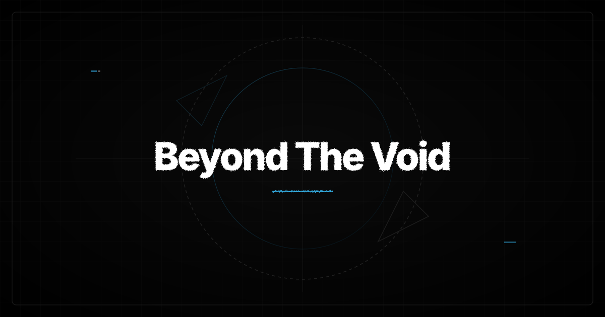

This page documents how all standard Markdown elements are styled in Unloyd. Use this as a reference when writing content.

> [!NOTE]
> This page covers **standard Markdown elements** only. For custom directives like Callout, Steps, Tabs, and Filetree, see the [Components](/docs/components/) section.

---

## Headings

Headings follow a clear hierarchy with consistent sizing and spacing.

To create a heading, use the hash symbol (#) followed by a space and your heading text. The number of hash symbols determines the heading level.

# Heading 1

## Heading 2

### Heading 3

#### Heading 4

##### Heading 5

###### Heading 6

## Paragraphs

Paragraphs are spaced consistently for readability. Simply write your text without any special formatting. Each new block of text separated by a blank line becomes a new paragraph.

This is a standard paragraph. It wraps naturally and maintains comfortable line length for reading.

This is another paragraph with a space between them.


## Emphasis

| Element | Syntax | Result |
|---------|--------|--------|
| Bold | `**bold text**` or `__bold text__` | **bold text** |
| Italic | `*italic text*` or `_italic text_` | *italic text* |
| Bold Italic | `***bold italic***` | ***bold italic*** |
| Strikethrough | `~~strikethrough~~` | ~~strikethrough~~ |
| Inline code | `` `code` `` | `code` |

## Lists

### Unordered List

Use hyphens (-), plus signs (+), or asterisks (*) at the start of a line. Indent nested items with two or four spaces.

- Item one
- Item two
- Item three
  - Nested item
  - Another nested item
- Item four

### Ordered List

Use numbers followed by a period at the start of a line.

1. First step
2. Second step
3. Third step
   1. Sub-step
   2. Another sub-step
4. Fourth step

### Task List (Checkbox)

Use hyphens followed by brackets to create task lists.

- [x] Completed task
- [ ] Incomplete task
- [ ] Another task

## Blockquotes

Use the greater-than symbol (>) at the start of a line to create a blockquote.

> This is a standard blockquote.
>
> It can span multiple paragraphs.

### Nested Blockquotes

Add multiple greater-than symbols for nested quotes.

> Level one
>> Level two
>>> Level three

## Tables

Tables are created using pipes (`|`) and hyphens (`-`). The header is separated from the body by a row of hyphens.

| Feature | Status | Version |
|---------|--------|---------|
| Astro 7 | ✅ | 7.2.0 |
| TailwindCSS 4 | ✅ | 4.0.0 |
| Sätteri | ✅ | 0.5.0 |

### Table with Alignment

Use colons (`:`) to align content within columns.

| Left | Center | Right |
|:-----|:------:|------:|
| Left | Center | Right |
| Cell | Cell | Cell |

## Code

### Inline Code

Wrap inline code with backticks (`).

Use the `npm install` command to install dependencies.

### Code Blocks

Indent code with four spaces or use backticks. For syntax highlighting, specify the language after the opening backticks.

A code block with JavaScript syntax highlighting.

```js
const greeting = 'Hello, world!';
console.log(greeting);
```


### Diff Blocks

Use diff syntax to show additions `// [!code ++]` and removals `// [!code --]`.

```js
const greeting = 'Hello, world!'; // [!code --]
console.log(greeting); // [!code ++]
```

## Horizontal Rules

Use three or more hyphens (`---`), asterisks (`***`), or underscores (`___`) on their own line.

---

## Links

### Standard Links

Create links with `[label](url)`.

[Unloyd Documentation](/docs/)

### External Links

External links automatically open in a new tab with `rel="noopener noreferrer"`. 

[Github](https://github.com/unloyd/)

## Images

Use `` to insert images.



### Images with Captions
Add a caption by placing `{caption text}` after the URL.

<figure>
  
  <figcaption>This is a caption</figcaption>
</figure>

> [!NOTE]
> Images with captions require the `{...}` syntax after the URL. See the [Figure](/docs/figure/) component for details.

## Footnotes
Footnotes use `[^1]` for references and `[^1]:` for definitions.

Here is a sentence with a footnote[^1].

[^1]: This is the footnote content.

## Keyboard Input
Use the `<kbd>` HTML tag for keyboard shortcuts.


Press <kbd>Ctrl</kbd> + <kbd>C</kbd> to copy.

## Summary
| Element | Syntax | Description |
|---------|--------|-------------|
| Heading 1 | `#` | Page title |
| Heading 2 | `##` | Section title |
| Heading 3 | `###` | Subsection title |
| Bold | `**text**` | Strong emphasis |
| Italic | `*text*` | Emphasis |
| Strikethrough | `~~text~~` | Deleted text |
| Inline code | `` `code` `` | Code inline |
| Blockquote | `>` | Quote or citation |
| Unordered list | `-` | Bullet points |
| Ordered list | `1.` | Numbered steps |
| Task list | `- [x]` | Checkbox list |
| Table | `\| --- \|` | Data table |
| Code block | ` ``` ` | Code with highlighting |
| Horizontal rule | `---` | Section separator |
| Link | `[text](url)` | Hyperlink |
| Image | `` | Image |
| Footnote | `[^1]` | Footnote reference |
| Keyboard | `<kbd>` | Keyboard key |

Happy writing! 🚀